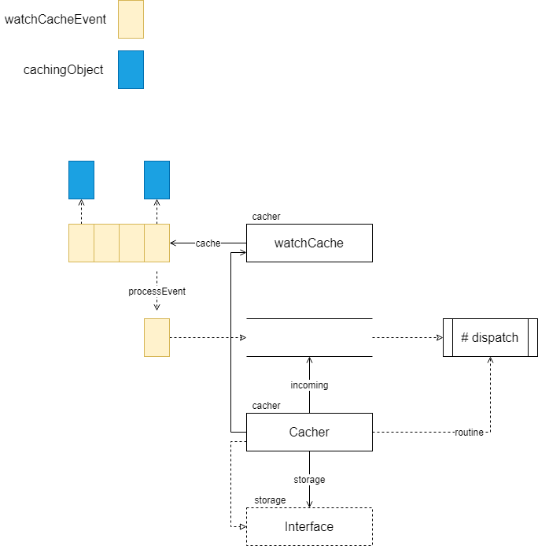

好消息，好消息！源码架构图系列完整啦！

大家好，我是杨鼎睿，Kubernetes 源码设计图已经整理完整啦，全部放在了云原生社区下，欢迎大家前来阅读！

为了方便广大读者的阅读，我们将所有的源码图整理到了 GitBook 中，大家不必为阅读的顺序而困扰啦。

[阅读点我](https://i.cloudnative.to/kubernetes/kubernetes/index) 

源码设计图共近 300 余张（近 200 张是手绘的架构设计图），覆盖主要组件包括 API Server，Controller，Scheduler，Proxy，Client 等，同时还有 Docker， Golang 等相关部分。源码图理念以架构设计（数据结构的设计）为主，决不为了讲述流程而画流程图，阅读时需要配合源码同时阅读，同时会有一小部分的问题留白，可以引导读者带着问题进入源码中寻求答案，希望能籍此帮助大家在学习 K8S 的同时提高自己的设计能力。 

从去年 6 月开始到今年，很多图例都经过多次打磨，大小，含义保证一致，如虚线箭头代表动作等，对各种流程如循环迭代的画图表达也经过多次改版，除此之外，尤在图中不同实体的相互位置有下功夫，如同一水平线代表同一层次等，欢迎在画图表达上多多交流，共同推进如此理念的源码架构图。（除 k8s 外，不少知名项目的源码架构图也已完成，欢迎交流）

这一系列完成过程中，超哥（Jimmy Song）给予了我很多支持，还有响哥（李响）的鼓励，也有不少前辈给予肯定，感谢大家的关注和阅读。

以下是系列中 API Server 部分中 Cacher 的选摘，欢迎阅读：

# Cacher 部分

本文研究了 Cacher 部分的源码，配备源码进行进一步理解，可以加深理解,增强相关设计能力。

## Overview

Cacher 包含了 storage.Interface 实例，这个实例是真正的存储后端实例。同时，Cacher 也实现了 storage.Interface 接口，这个是典型的**装饰器模式**。Kubernetes 源码中，有大量优雅的**设计模式**的运用，在阅读时可多加注意。简单追踪了下代码，目前猜测的关系如下所示。

registry 包位置如下

storage 位置如下

Store 初始化代码中，设置 DryRunnableStorage 位置

## Store

### Interface Definition
Store 接口定义在 k8s.io/client-go 中，注意接口中的 Add/Update/Delete，作用是向 Store 中添加对象。那么这个接口的作用就是：API Server 与 Etcd 间的粘合剂。

## Event Main Cycle

Cacher 结构定义如下，它包含了一个 watchCache 实例。

再看一下 Cacher 初始化方法，373 行用于创建 watchCache 实例，其中传入的 EventHandler 是 Cacher 的方法，这样，watchCache 就有了向 Cacher 注入事件的通道。

上面代码中 dispatchEvents 方法看起来是对从 watchCache 方法发送过来的 Event 进行处理的部分，我们继续，看起来我们马上就要解决事件来源问题了。

跟踪一下 incoming，那么 processEvent 是否似曾相识呢？

到 watchCache 结构中，找到使用 eventHandler 的位置。

继续挖掘，至此，我们找到了事件完整来源，且**事件只有三种类型**：Add/Update/Delete。

### watchCache.processEvent
原始事件到最终事件的生成如下图所示，使用的 keyFunc、getAttrsFunc、Indexer 等均通过配置传入。

事件创建完毕后，刷新缓存

## Event Generation

### Cache Watcher
Cacher 中关于 cacheWatcher 的相关结构如下图所示

cacheWatcher 实现了 watch.Interface 接口，用于监听事件。watch.Interface 声明如下所示

watch.Event 定义如下所示

cacheWatcher 核心处理流程如下所示

### Watch

#### Cacher

triggerValue、triggerSupported 判定过程如下

cacheWatcher 的 input channel 缓存大小计算如下

具体添加代码如下

forgetWatcher 如下所示，从 Cacher 中清理 watcher。

## Event Dispatching

### Bookmark Event

在 Cacher 事件分发过程中，创建了一个 Timer，这个 Timer 每次触发时，有可能会产生一个 Bookmark Event 事件，并分发这个事件。源码如下所示

#### Dispatch
Bookmark Event 创建后，通过 Versioner 更新事件对象的 ResourceVersion 信息，然后将这个事件进行分发，接下来，我们具体看一下如何分发。

Bookmark Event 分发流程如下图所示，可以看到，事件已分发至全部 ID 小于当前时间的 cacheWatcher 中。

到达 cacheWatcher 后，处理非常简单，只是返回原始对象而已。

### General Event

#### Dispatch

从上图可以看到，当 watchersBuffer 长度大于等于 3 时，将对象缓存起来进行发送。发送 event 时，如果有失败，则获取一个可用时间片，在这个时间片内，尝试阻塞的发送该事件。如果全部发送成功，则等待时间片消耗完毕。

如果在时间片内发送失败，则删除剩余的 cacheWatcher

## References

- [https://kubernetes.io/docs/reference/using-api/api-concepts/](https://kubernetes.io/docs/reference/using-api/api-concepts/)
